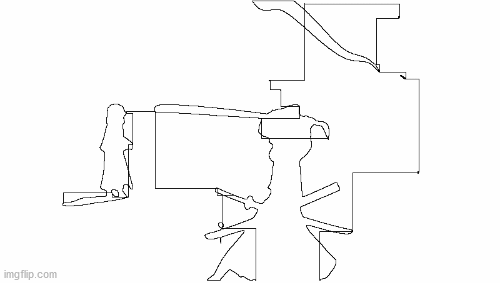

# Bad Apple Etch a Sketch

  

Bad apple played on a etch a sketch. This program allows to draw the edges of a picture using a single line. The final goal is to stick (or tape idk) servos to control an Etch a Sketch to draw the [Bad Apple](https://www.youtube.com/watch?v=9lNZ_Rnr7Jc) animation.

**update** : I used it to render [this animation](https://youtu.be/LD4D09EVcDY?t=112) on Blender

  

